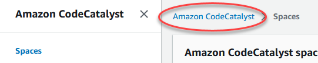
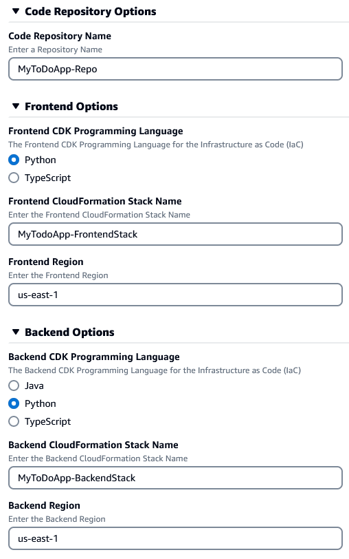
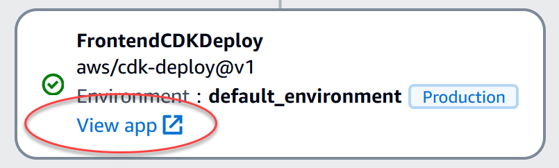

## AWS Bot-to-bot interoperability end-to-end Sample
This sample builds a website and two bots in the Amazon AWS. The site is a simple To Do List app. The first Bot is for booking appointments and knows about the website's RESTful API so it can add the appointment as a To Do Item in the List. This Bot does not know how to book flight as a type of appointment. The second Bot knows a lot about Airline services, including Booking a Flight. 

Using the Open Voice Network's Interoperability Specification, when a user asks the first bot to book a flight, rather than failing, it hands off the task to the second bot. The second bot books the flight, returning the booking information to the first bot so that it can create an appointment for the flight itinerary and create the related To Do Item.

The main purpose of this sample is to showcase the interoperability between the two bots. The website and each bot's web UIs are there to provide visibility into this otherwise backend process. By following the step-by-step instructions, you will be able to recreate the related AWS objects and see this sample working in your own AWS environment. 

NOTE: It is possible that the AWS components used in this sample will change over time, but the principles showcased should hold true. Please let us know if there are any difficulties or problems executing the scripts and instructions.

## What we will be Creating
Using this sample, you will deploy myriad AWS objects that set up:
 1. An Amazon CodeCatalyst Project that builds:
- A single-page ToDo App Website hosted in S3 and CloudFront.
- A RESTful API backend using:
  - An AWS API Gateway to provide the REST interface
  - An Amazon DynamoDB for item persistence
  - A set of AWS Lambda functions that provide the glue between the two
 3. An Amazon Lex Bot that can be used to create appointments (that will be shown in the ToDo App as ToDo Items).
 4. A second Amazon Lex Bot that can be used to Book A Flight.
 5. A Lambda function that implements the Open Voice Network's Bot Interoperability Standard to provide an interface between the Appointment Bot and the Book a Flight Bot so that the former can use the latter to create a Flight Appointment, which will appear as a ToDo Item in the website.

## Sample Project and CloudFormation Templates
Some of this sample is provided by creating a new Amazon CodeCatalyst Project. 

Some of this sample is created by running CloudFormation Templates that will deploy the objects needed to implement the solution.

The final part of this sample shows how to implement bot-to-bot communication using the Open Voice Network's Bot Interoperability Standard and Python code.

## Step 1: Create the ToDo WebApp as an Amazon CodeCatalyst Project
The following steps will walk you through the creation of the Amazon CodeCatalyst Project for the ToDo WebApp.
 1. Login to the AWS Console or create an AWS Console account at https://console.aws.amazon.com.
 2. Search for the Amazon CodeCatalyst Service.
 
 3. Switch to the US West (Oregon) Region until CodeCatalyst is available in other regions.
 
 4. Select your CodeCatalyst Space and click the button to Go to Amazon CodeCatalyst. 
 5. OR... 

    a. Click the Amazon CodeCatalyst breadcrumb.
    
    b. Click the Continue with AWS Builder ID button.
    
    c. Click the Get started for free button.
    
    d. Create and verify your AWS Builder ID.  
    e. Create your CodeCatalyst alias.  
    f. Create your CodeCatalyst Space name.  
    g. Verify the Space in the AWS Console.  
    h. With your Space verified, you can Skip the project creation so you can move on to step 6 below.
 6. From the CodeCatalyst Space, click the Create Project button.
 7. Pick Start with a Blueprint.
 8. Pick the To Do web application blueprint.
 9. Click Next.
 10. Enter a Project Name, such as MyToDoApp.
 11. Click the Add IAM role button. Create the CodeCatalyst development administrator role in IAM. 
 12. Switch back to the CodeCatalyst tab. Select the new role as the CDK Role.
 13. Expand the Code Repository Options and change the name to something like your project name, such as MyToDoApp-Repo.
 14. Expand the Frontend Options and select the language of your choice. Then change the name of the stack to something like your project name, such as MyToDoApp-FrontendStack, and change the Region to your preferred Region.
 15. Expand the Backend Options and select the language of your choice. Then change the name of the stack to something like your project name, such as MyToDoApp-BackendStack, and change the Region to your preferred Region.
 16. Verify that all the settings are as you want.
 
 17. Click the Create project button. This will create the project and kick off a workflow run to build and deploy the frontend and backend components to AWS. Sit back and relax, this part takes 10 minutes or so.
 18. Refresh the browser to View the Workflow Runs. Select the active or most recent run. In the flow diagram, wait for the last step to complete (it will have a green checkmark in it). 
 19. Click on the View App link in the last step to view the ToDo WebApp.
 
 20. Create a New ToDo item to test the page.
 21. Done.

 ## Step 2: Create the Lex Appointment Bot

 1. Back in AWS Console, search for Lex.
 2. Select the Amazon Lex tile.
 3. In the Bots section, select the Create bot button.
 4. Click on Start with an example.
 5. Select the MakeAppointment Sample bot.
 6. Enter the Bot Name, such as MyAppointmentBot.
 7. In IAM permissions, Select to Create a role with basic Amazon Lex permissions.
 8. In the Children's Privacy, select No.
 9. Click the Next button.
 10. In the Add a language screen, select a voice for your Voice interaction.
 11. Click Done.
 12. Shortly, you will be on the Intent: MakeAppointment screen. Click the Save intent button.
 13. At the top, click the Build button.
 14. Once built, click the Test button to try out your bot. Start with "I need to make an appointment." Then, "A dentist appointment." Then, "Tomorrow." Then, "Now." Then, "Yes." You should see the intent is fulfilled.
 15. Now, we need to release the bot to Prod. Select to go back to the intents list.
 16. Select Bot Versions on the left.
 17. Create a new version.
 18. Done.

## Step 3: Create a Web UI for the Lex Bot
In order to work with the Lex Bot, it needs a client. The easiest way to spin up a client is to use the Sample Amazon Lex Web Interface from GitHub. To create this, follow these steps:
 1. In a new tab, navigate to https://github.com/aws-samples/aws-lex-web-ui.
 2. Scroll down to the getting started section and click the Launch Stack button for the region you want the Web UI to be hosted in.
 3. In the Quick create stack screen, enter a Stack name, such as MyAppointmentBotWebUIStack.
 4. Change the CodeBuildName to something unique to the region, such as MyAppointmentBotWebUI.
 5. Scroll down to the Lex V2 Bot section. Flip back to the Bot tab and copy the Bot ID and paste it into the LexV2BotId parameter in the CloudFormation - Stack tab.
  
 6. Click on the View aliases button back in the Bot tab. Click the Create alias button. Enter PROD as the name. Choose Version 1 as the version. Click Create.
 7. Select the PROD Alias. Copy the Alias ID into the LexV2BotAliasId parameter in the CloudFormation - Stack tab.
 8. Scroll down to Web Application Parameters. Enter the web address of the S3 bucket for the ToDo WebApp in the WebAppPath. To get this value, you will need to open a new tab to the AWS Console and search for the CloudFront service. Now, select the distribution for the ToDo WebApp. Then select the Origins tab. Select Origin1. Click Edit. Copy the URL shown in the Origin domain field. Paste this URL into the WebAppParentOrigin parameter.
 9. Enter **/index.html** in the WebAppPath parameter.
 10. Enter **You can ask me for help making appointments. Just type "Make an appointment" or click on the mic and say it.** in the WebAppConfBotInitialText parameter.
 11. Enter **Say 'Make Appointment' to get started.** in the WebAppConfInitialSpeech parameter.
 12. Enter **Make an Appointment** in the WebAppConfToolbarTitle parameter.
 13. Set the ShouldLoadIframeMinimized parameter to true.
 14. Scroll to the bottom, check the warnings and click Create stack.
 15. Wait for CloudFormation to finish the deployment. Then click on the parent stack, such as MyAppointmentBotWebUIStack. Click the Outputs tab. Click the WebAppDomainName link (a CloudFront domain). NOTE: Despite all the settings, the page title will be Order Flowers Bot. We'll fix that in a minute.
 16. 

## Step 4: Wire up the Lex Bot to the ToDo WebApp
Now, we need to wire up the API call to put the appointment from the bot into the ToDo WebApp.
 1.  

