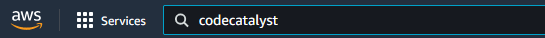
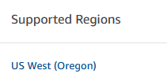
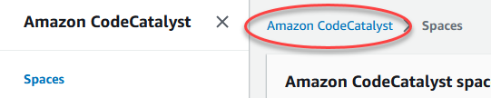
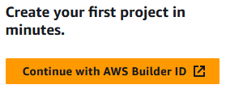
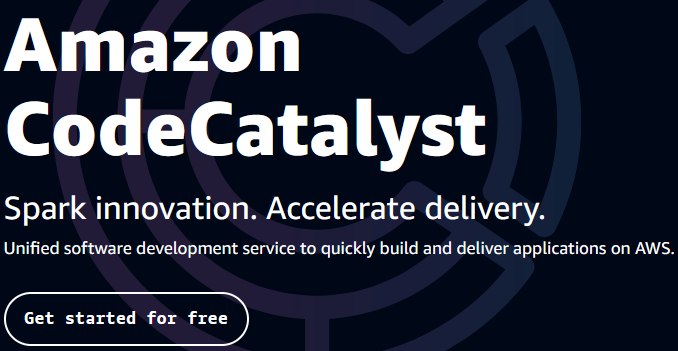
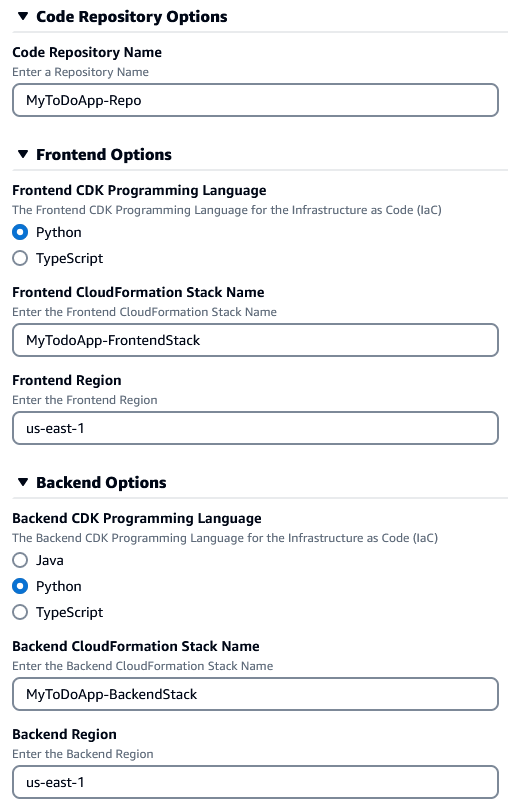
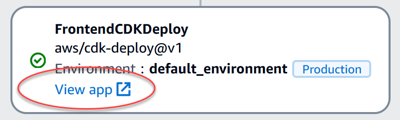

# Step 1: Create the ToDo WebApp as an Amazon CodeCatalyst Project

The following steps will walk you through the creation of the Amazon CodeCatalyst Project for the ToDo WebApp.

1. Login to the AWS Console or create an AWS Console account at [https://console.aws.amazon.com](https://console.aws.amazon.com).
2. Search for the Amazon CodeCatalyst Service.

   

3. Switch to the US West (Oregon) Region (until CodeCatalyst is available in other regions).

   

4. Select your CodeCatalyst Space and click the button to Go to Amazon CodeCatalyst.
5. OR...

    a. Click the Amazon CodeCatalyst breadcrumb.

    

    b. Click the Continue with AWS Builder ID button.

    

    c. Click the Get started for free button.

    

    d. Create and verify your AWS Builder ID.

    e. Create your CodeCatalyst alias.

    f. Create your CodeCatalyst Space name.

    g. Verify the Space in the AWS Console.

    h. With your Space verified, you can Skip the project creation so you can move on to step 6 below.

6. From the CodeCatalyst Space, click the Create Project button.
7. Pick Start with a Blueprint.
8. Pick the To Do web application blueprint.
9. Click Next.
10. Enter a Project Name, such as MyToDoApp.
11. Click the Add IAM role button. Create the CodeCatalyst development administrator role in IAM.
12. Switch back to the CodeCatalyst tab. Select the new role as the CDK Role.
13. Expand the Code Repository Options and change the name to something like your project name, such as MyToDoApp-Repo.
14. Expand the Frontend Options and select the language of your choice. Then change the name of the stack to something like your project name, such as MyToDoApp-FrontendStack, and change the Region to your preferred Region.
15. Expand the Backend Options and select the language of your choice. Then change the name of the stack to something like your project name, such as MyToDoApp-BackendStack, and change the Region to your preferred Region.
16. Verify that all the settings are as you want.

    

17. Click the Create project button. This will create the project and kick off a workflow run to build and deploy the frontend and backend components to AWS. Sit back and relax, this part takes 10 minutes or so.
18. Refresh the browser to View the Workflow Runs. Select the active or most recent run. In the flow diagram, wait for the last step to complete (it will have a green checkmark in it).
19. Click on the View App link in the last step to view the ToDo WebApp.

    

20. Create a New ToDo item to test the page.
21. Done.
