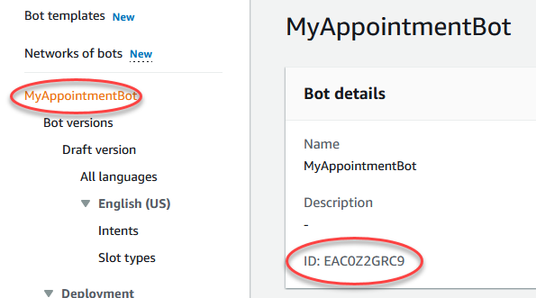

# Step 3: Create a Web UI for the Appointment Bot

In order to work with the Lex Bot, it needs a client. The easiest way to spin up a client is to use the Sample Amazon Lex Web Interface from GitHub. To create this, follow these steps:

1. In a new tab, navigate to [https://github.com/aws-samples/aws-lex-web-ui](https://github.com/aws-samples/aws-lex-web-ui).
2. Scroll down to the getting started section and click the Launch Stack button for the region you want the Web UI to be hosted in.
3. In the Quick create stack screen, enter a Stack name, such as MyAppointmentBotWebUIStack.
4. Change the CodeBuildName to something unique to the region, such as MyAppointmentBotWebUI.
5. Scroll down to the Lex V2 Bot section. Flip back to the Bot tab and copy the Bot ID and paste it into the LexV2BotId parameter in the CloudFormation - Stack tab.

    

6. Click on the View aliases button back in the Bot tab. Click the Create alias button. Enter PROD as the name. Choose Version 1 as the version. Click Create.
7. Select the PROD Alias. Copy the Alias ID into the LexV2BotAliasId parameter in the CloudFormation - Stack tab.
8. Scroll down to Web Application Parameters. Enter the web address of the S3 bucket for the ToDo WebApp in the WebAppPath. To get this value, you will need to open a new tab to the AWS Console and search for the CloudFront service. Now, select the distribution for the ToDo WebApp. Then select the Origins tab. Select Origin1. Click Edit. Copy the URL shown in the Origin domain field. Paste this URL into the WebAppParentOrigin parameter.
9. Enter **/index.html** in the WebAppPath parameter.
10. Enter **You can ask me to make an appointment. Just type "Make an appointment" or click on the mic and say it.** in the WebAppConfBotInitialText parameter.
11. Enter **Say 'Make an Appointment' to get started.** in the WebAppConfInitialSpeech parameter.
12. Enter **Make an Appointment** in the WebAppConfToolbarTitle parameter.
13. Set the ShouldLoadIframeMinimized parameter to true.
14. Scroll to the bottom, check the warnings and click Create stack.
15. Wait for CloudFormation to finish the deployment. Then click on the parent stack, such as MyAppointmentBotWebUIStack. Click the Outputs tab. Click the WebAppDomainName link (a CloudFront domain). NOTE: Despite all the settings, the page title will be Order Flowers Bot.

    (The easiest(?) way to fix this, is to navigate to the S3 Bucket: myappointmentbotwebuistack-codebuild-webappbucket-xxxxxxxx. Then, download the  lex-web-ui-min.js JavaScript file. Open it in a text editor and search for "Order Flowers Bot" and replace it with "Make an Appointment Bot". Save the file and upload it back to the bucket. Then, to clear the CloudFront cache, flip over to CloudFront, open the distribution for the lex-web-ui, select the invalidations tab, select one of the invalidations, select Copy to New, then select Create Invalidation. Once the cache is cleared, the changes to the JavaScript will be apparent when you hard refresh the Lex UI in your browser.)

16. Done.

- [Back < Step 2: Create the Lex Appointment Bot](./Step%202.md)
- [Next > Step 4: Wire up the Lex Bot to the ToDo WebApp](./Step%204.md)
