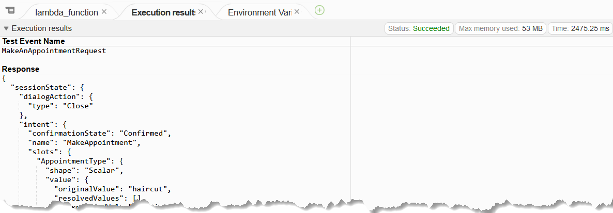
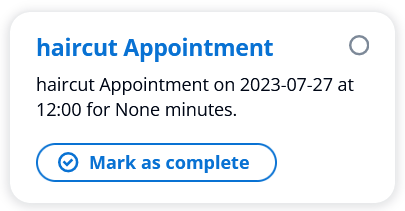

# Step 4: Wire up the Lex Bot to the ToDo WebApp

Now, we need to wire up the API call to put the appointment from the bot into the ToDo WebApp.

1. In the AWS Console, search and select Lex.
2. Select the MakeAppointment bot.
3. Drill down to the intents list. Select the MakeAppointment intent.
4. Scroll down to the fulfilment section. Set the Active toggle to on. Click on Save Intent.
5. Now switch to the CloudFront console.
6. Locate the CloudFront distribution you created for the ToDo WebApp.
7. Select the Origins tab.
8. Select origin2 for the API Gateway and click Edit.
9. Copy the Origin domain shown and save it for use in the next steps.
10. Now switch to the Lambda console.
11. Locate the Lambda function you created for the bot.
12. In the lambda_function.py module, insert the following import statement at the top of the file:

```python
import requests
```

13. Now, to make the import requests work, we need to create two things: a requirements.txt file and a layer.
14. In the lambda function code editor, right-click on the folder icon to the left of the lambda_function.py file name. Select New File.
15. Name the file requirements.txt.
16. In the contents of the file, enter the following:

```text
requests
```

17. Save the file.
18. Now, we need to create a layer. Back in the Lambda console (not the code window), select Layers from the left-hand menu.
19. Click Create layer.
20. Name the layer something like "PythonDependencies".
21. In the Layer configuration, click Upload a .zip file, and upload the [python.zip](./source/layers/python.zip) file from the layers source folder.
22. Check the box for x86_64 architecture.
23. Select Python 3.8 as the runtime.
24. Click Create.
25. Now, go back to the Lambda function code editor.
26. Scroll to the bottom. Select Add a layer.
27. Choose Custom layers and select the layer you just created.
28. Click Add.
29. Next, scroll down to the bottom, then scroll up a little to above the line:

```python
""" --- Intents --- """
```

30. Above that line, insert the following function to call the API to create a ToDo Item:

```python
def send_booking_to_todo_app(appointment_type, date, appointment_time, duration):
    """
    Called to write the appointment as a todo card in the todo webapp
    """
    logger.debug('Trying to save to ToDo app.')

    title = f"{appointment_type} Appointment"
    description = f"{appointment_type} Appointment on {date} at {appointment_time} for {duration} minutes."

    data = {
        "title": title,
        "description": description
    }
    # Replace with your API Gateway URL
    gateway = "https://123456789.execute-api.us-east-1.amazonaws.com"
    url = f"{gateway}/prod/api/todos"
    response = requests.post(url, json=data)

    if response.status_code != 201:
        logger.debug('Failed to save to ToDo app.')
        raise Exception(f"There was a problem saving the ToDo item.\nError code: {response.status_code}")
```

31. Scroll up to the make_appointment() function.
32. That code is out of date, and needs to be replaced with this (see Python file [lambda_function.py](./source/python/lambda_function.py))):

```python
def make_appointment(intent_request):
    """
    Performs dialog management and fulfillment for booking a dentists appointment.

    Beyond fulfillment, the implementation for this intent demonstrates the following:
    1) Use of elicitSlot in slot validation and re-prompting
    2) Use of confirmIntent to support the confirmation of inferred slot values, when confirmation is required
    on the bot model and the inferred slot values fully specify the intent.
    """
    session = intent_request['sessionState']
    intent = session['intent']
    slots = intent['slots']
    appointment_type = slots['AppointmentType']['value']['interpretedValue']
    date = slots['Date']['value']['interpretedValue']
    appointment_time = slots['Time']['value']['interpretedValue']
    source = intent_request['invocationSource']
    output_session_attributes = session['sessionAttributes'] if session['sessionAttributes'] is not None else {}
    booking_map = json.loads(try_ex(lambda: output_session_attributes['bookingMap']) or '{}')

    if source == 'DialogCodeHook':
        # Perform basic validation on the supplied input slots.
        # slots = intent_request['currentIntent']['slots']
        validation_result = validate_book_appointment(appointment_type, date, appointment_time)
        if not validation_result['isValid']:
            slots[validation_result['violatedSlot']] = None
            return elicit_slot(
                output_session_attributes,
                intent['name'],
                slots,
                validation_result['violatedSlot'],
                validation_result['message'],
                build_response_card(
                    'Specify {}'.format(validation_result['violatedSlot']),
                    validation_result['message']['content'],
                    build_options(validation_result['violatedSlot'], appointment_type, date, booking_map)
                )
            )

        if not appointment_type:
            return elicit_slot(
                output_session_attributes,
                intent['name'],
                slots,
                'AppointmentType',
                {'contentType': 'PlainText', 'content': 'What type of appointment would you like to schedule?'},
                build_response_card(
                    'Specify Appointment Type', 'What type of appointment would you like to schedule?',
                    build_options('AppointmentType', appointment_type, date, None)
                )
            )

        if appointment_type and not date:
            return elicit_slot(
                output_session_attributes,
                intent['name'],
                slots,
                'Date',
                {'contentType': 'PlainText', 'content': 'When would you like to schedule your {}?'.format(appointment_type)},
                build_response_card(
                    'Specify Date',
                    'When would you like to schedule your {}?'.format(appointment_type),
                    build_options('Date', appointment_type, date, None)
                )
            )

        if appointment_type and date:
            # Fetch or generate the availabilities for the given date.
            booking_availabilities = try_ex(lambda: booking_map[date])
            if booking_availabilities is None:
                booking_availabilities = get_availabilities(date)
                booking_map[date] = booking_availabilities
                output_session_attributes['bookingMap'] = json.dumps(booking_map)

            appointment_type_availabilities = get_availabilities_for_duration(get_duration(appointment_type), booking_availabilities)
            if len(appointment_type_availabilities) == 0:
                # No availability on this day at all; ask for a new date and time.
                slots['Date'] = None
                slots['Time'] = None
                return elicit_slot(
                    output_session_attributes,
                    intent['name'],
                    slots,
                    'Date',
                    {'contentType': 'PlainText', 'content': 'We do not have any availability on that date, is there another day which works for you?'},
                    build_response_card(
                        'Specify Date',
                        'What day works best for you?',
                        build_options('Date', appointment_type, date, booking_map)
                    )
                )

            message_content = 'What time on {} works for you? '.format(date)
            if appointment_time:
                output_session_attributes['formattedTime'] = build_time_output_string(appointment_time)
                # Validate that proposed time for the appointment can be booked by first fetching the availabilities for the given day.  To
                # give consistent behavior in the sample, this is stored in sessionAttributes after the first lookup.
                if is_available(appointment_time, get_duration(appointment_type), booking_availabilities):
                    return delegate(output_session_attributes, slots)
                message_content = 'The time you requested is not available. '

            if len(appointment_type_availabilities) == 1:
                # If there is only one availability on the given date, try to confirm it.
                slots['Time'] = appointment_type_availabilities[0]
                return confirm_intent(
                    output_session_attributes,
                    intent['name'],
                    slots,
                    {
                        'contentType': 'PlainText',
                        'content': '{}{} is our only availability, does that work for you?'.format
                                   (message_content, build_time_output_string(appointment_type_availabilities[0]))
                    },
                    build_response_card(
                        'Confirm Appointment',
                        'Is {} on {} okay?'.format(build_time_output_string(appointment_type_availabilities[0]), date),
                        [{'text': 'yes', 'value': 'yes'}, {'text': 'no', 'value': 'no'}]
                    )
                )

            available_time_string = build_available_time_string(appointment_type_availabilities)
            return elicit_slot(
                output_session_attributes,
                intent['name'],
                slots,
                'Time',
                {'contentType': 'PlainText', 'content': '{}{}'.format(message_content, available_time_string)},
                build_response_card(
                    'Specify Time',
                    'What time works best for you?',
                    build_options('Time', appointment_type, date, booking_map)
                )
            )

        return delegate(output_session_attributes, slots)

    # Book the appointment.  In a real bot, this would likely involve a call to a backend service.
    duration = get_duration(appointment_type)
    booking_availabilities = try_ex(lambda: booking_map[date])
    if booking_availabilities:
        # Remove the availability slot for the given date as it has now been booked.
        booking_availabilities.remove(appointment_time)
        if duration == 60:
            second_half_hour_time = increment_time_by_thirty_mins(appointment_time)
            booking_availabilities.remove(second_half_hour_time)

        booking_map[date] = booking_availabilities
        output_session_attributes['bookingMap'] = json.dumps(booking_map)
    else:
        # This is not treated as an error as this code sample supports functionality either as fulfillment or dialog code hook.
        logger.debug('Availabilities for {} were null at fulfillment time.  '
                     'This should have been initialized if this function was configured as the dialog code hook'.format(date))

    send_booking_to_todo_app(appointment_type, date, appointment_time, duration)
    logging.debug('Saved the booking to the ToDo app.')

    intent['state'] = 'Fulfilled'
    return {
        'sessionState': {
            'dialogAction': {
                'type': 'Close'
            },
            'intent': intent
        },
        'requestAttributes': {},
        'messages': [
            {
                'contentType': 'PlainText',
                'content': 'Okay, I have booked your appointment.  We will see you at {} on {}'.format(build_time_output_string(appointment_time), date)
            }
        ]
    }
 ```

33. Deploy the Lambda function.
34. To test the Lambda, click on the Test button and choose to configure a test.
35. Create a new event named MakeAnAppointment.
36. In the event JSON, replace what is there with the following (see JSON source file [MakeAnAppointment.json](./source/json/MakeAnAppointment.json)):

```json
{
    "sessionId": "817861573333671",
    "inputTranscript": "yes",
    "interpretations": [
        {
            "intent": {
                "confirmationState": "Confirmed",
                "name": "MakeAppointment",
                "slots": {
                    "AppointmentType": {
                        "shape": "Scalar",
                        "value": {
                            "originalValue": "haircut",
                            "resolvedValues": [],
                            "interpretedValue": "haircut"
                        }
                    },
                    "Time": {
                        "shape": "Scalar",
                        "value": {
                            "originalValue": "noon",
                            "resolvedValues": [
                                "12:00"
                            ],
                            "interpretedValue": "12:00"
                        }
                    },
                    "Date": {
                        "shape": "Scalar",
                        "value": {
                            "originalValue": "tomorrow",
                            "resolvedValues": [
                                "2023-07-27"
                            ],
                            "interpretedValue": "2023-07-27"
                        }
                    }
                },
                "state": "ReadyForFulfillment"
            },
            "nluConfidence": 1
        },
        {
            "intent": {
                "confirmationState": "None",
                "name": "FallbackIntent",
                "slots": {},
                "state": "ReadyForFulfillment"
            }
        }
    ],
    "bot": {
        "aliasId": "TSTALIASID",
        "aliasName": "TestBotAlias",
        "name": "MyAppointmentBot",
        "version": "DRAFT",
        "localeId": "en_US",
        "id": "EAC0Z2GRC9"
    },
    "responseContentType": "text/plain; charset=utf-8",
    "sessionState": {
        "sessionAttributes": {},
        "intent": {
            "confirmationState": "Confirmed",
            "name": "MakeAppointment",
            "slots": {
                "AppointmentType": {
                    "shape": "Scalar",
                    "value": {
                        "originalValue": "haircut",
                        "resolvedValues": [],
                        "interpretedValue": "haircut"
                    }
                },
                "Time": {
                    "shape": "Scalar",
                    "value": {
                        "originalValue": "noon",
                        "resolvedValues": [
                            "12:00"
                        ],
                        "interpretedValue": "12:00"
                    }
                },
                "Date": {
                    "shape": "Scalar",
                    "value": {
                        "originalValue": "tomorrow",
                        "resolvedValues": [
                            "2023-07-27"
                        ],
                        "interpretedValue": "2023-07-27"
                    }
                }
            },
            "state": "ReadyForFulfillment"
        },
        "originatingRequestId": "bc967ef2-ee58-41b7-b5dc-becb7243e8f1"
    },
    "messageVersion": "1.0",
    "invocationSource": "FulfillmentCodeHook",
    "transcriptions": [
        {
            "resolvedContext": {
                "intent": "MakeAppointment"
            },
            "transcription": "yes",
            "resolvedSlots": {},
            "transcriptionConfidence": 1
        }
    ],
    "inputMode": "Text"
}
```

37. Save the event.
38. Click the test button and choose the MakeAnAppointment event. With a good dose of luck, the code will execute successfully and you will see a message like the one below. If not, debug and fix the issue before proceeding.

    

39. With a successful execution, you can flip over to the ToDo App tab and refresh. You should see a new ToDo item created.

    

40. Now, we need to test the bot. Flip over to the Make an Appointment Bot tab.
41. Run the bot through the Web UI. Refresh teh ToDo App again to ensure the new ToDo item is created properly.
42. Phew. Done.

- [Back < Step 3: Create a Web UI for the Appointment Bot](./Step%203.md)
- [Next > Step 5: Create the Airline System Lex Bot](Step%205.md)