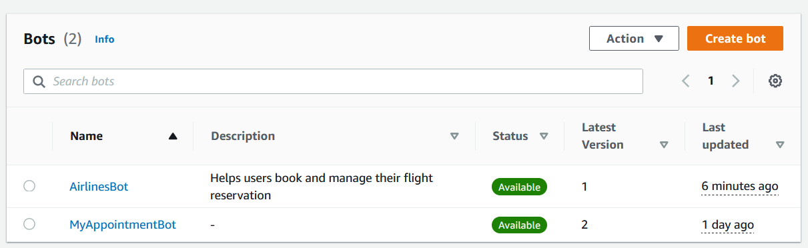

# Step 5: Create the Airline System Lex Bot

We're going to create this bot a little differently. Instead of creating the bot by starting with an example, like we did in Step 2, we're going to use a Bot Template. This will give us a more complete bot, with more intents and slots, than we would get if we started with just an example. It will also create the lambda function for us. To do this, follow these steps:

1. In the Lex console, select Bot templates from the left menu.
2. In the Bot templates section of the screen, locate the Airline services template and click the Create button.
3. Expand and take note of the Sample conversation. This is a sample conversation that you can use to test your bot. You can also use this, in combination with the Sample Data, to get an idea of the types of things you can say to your bot.

```text
    User: I want to book a flight
Bot: I see you have a frequent flyer account with us. Can you confirm the frequent flyer ID?
    User: Yes, it's 34567
Bot: Thank you. And for verification, can I get the last four digits of the credit card on file?
    User: 3456
Bot: Got it. Let me get some information about your trip. Is this reservation for a one-way trip or a round trip?
    User: One way
Bot: Got it. What's the departure city?
    User: Dallas
Bot: Dallas. Ok. And what's your destination?
    User: New York
Bot: Got it. What date would you like to take the flight?
    User: January 1st
Bot: OK. What's the total number of travelers?
    User: 1
Bot: Okay. What's your preferred time of departure?
    User: 12 PM
Bot: Ok. I have flight number A123 departing at 5:30am. The cost of this flight is $100. If you want to proceed with this, just say yes. Otherwise, say, get more options
    User: Yes
Bot: Can I use the card on file ending in 3456 to make the reservation?
    User: Yes
Bot: Great. I have you on the B123 to New York departing from Dallas on 2024-01-01 at 6:30am. Your confirmation code is 93909.
```

4. Click the Create button. This will switch you to the CloudFormation Quick create stack screen.
5. Leave the defaults, scroll down to the bottom of the screen, check the acknowledgement, and then click the Create stack button.
6. A few minutes later, the stack should be complete. You can verify this by checking the status of the stack in the CloudFormation console. Once the stack is complete, you can test your bot by clicking the Test bot button in the Lex console and by using the sample conversation above.
7. You should now have two bots:



8. Select the Airlines bot. Select the English language and click the Build button.
9. Then click the Test button. You should be able to follow the test script above.
10. Once you have successfully tested the bot, navigate to the Bot versions option on the left.
11. Click the Create version button.
12. Navigate to Aliases on the left.
13. Select the Prod alias.
14. Click the Associate version with alias button.
15. Select the new version you just created. Click the Associate button.
16. Done. You now have a bot that you can use to book flights.

- [Back <  Step 4: Wire up the Lex Bot to the ToDo WebApp](./Step%204.md)
- [Next > Step 6: Create a Web UI for the Airline System Bot](Step%206.md)