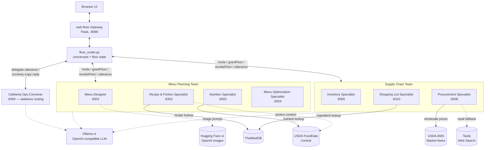
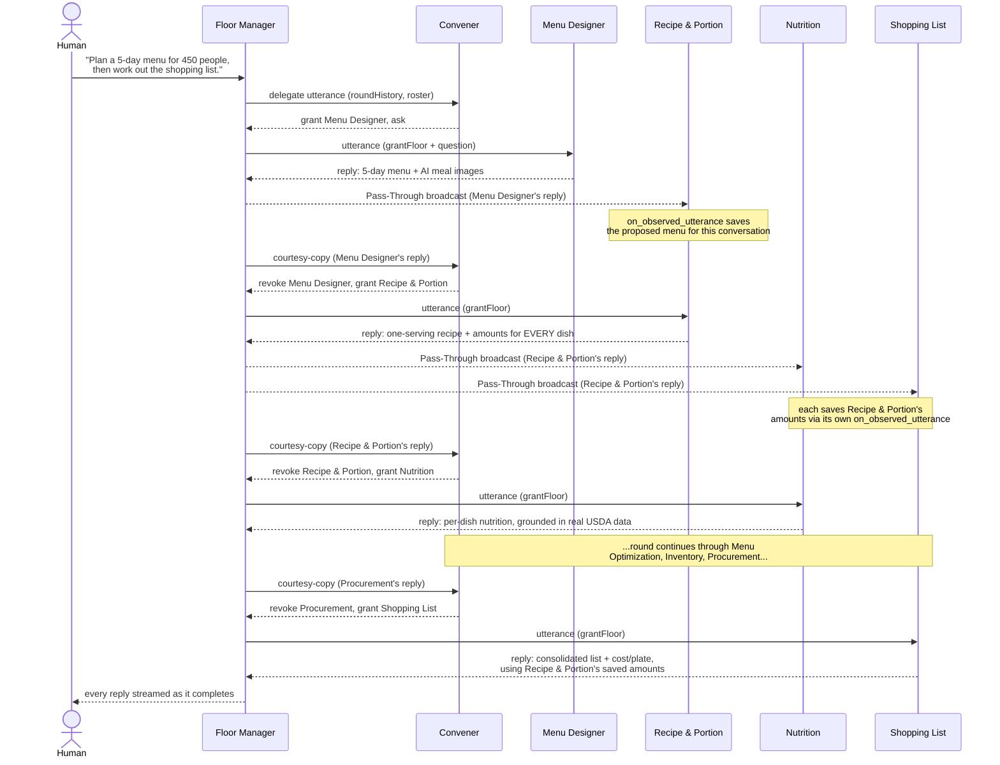

# Cafeteria Ops Floor

An Open Floor Protocol (OFP) multi-agent system for corporate cafeteria lunch menu planning and supply-chain operations. A user asks about a menu, ingredient, or sourcing question, and the convener routes it to the right specialist(s).

## What Runs

The stack starts these services:

| Service | Port | Team | Purpose |
|---|---|---|---|
| Convener | 8300 | — | Stateless decision service: tells the floor manager who to invite/grant next |
| Menu Designer | 8301 | Menu Planning | Lunch menu concepts, weekly variety, theme -- illustrated with an AI-generated image per meal |
| Nutrition Specialist | 8302 | Menu Planning | Calories/macros/sodium using real USDA FoodData Central data |
| Recipe & Portion Specialist | 8303 | Menu Planning | Real recipe ideas (TheMealDB) and cafeteria-scale portion sizing |
| Menu Optimization Specialist | 8304 | Menu Planning | Cost, ingredient reuse, and waste reduction across the menu mix |
| Inventory Specialist | 8305 | Supply Chain | Par levels, stockout/overstock risk |
| Procurement Specialist | 8306 | Supply Chain | Sourcing decisions grounded in real USDA wholesale data, with a real web-search fallback for items USDA doesn't track |
| Shopping List Specialist | 8310 | Supply Chain | Sums a week's menu into total ingredient quantities, estimated costs, and cost-per-plate, using real per-dish ingredient data |

Supplier, Receiving & Storage, and Supply Optimization Specialists were removed: they were pure LLM-reasoning advisory agents (vendor risk, storage/FIFO conditions, delivery scheduling) that didn't produce anything usable toward this project's actual deliverable -- a concrete, itemized shopping list. Ports 8307-8309 are free.

## System Architecture

### Components



Every service is a plain OFP `BotAgent` (`agents/base_strategy_agent.py`) or, for the convener, a stateless Flask decision endpoint (`convener_service/convener.py`) -- there is no orchestrator process. The floor manager (web-floor's gateway, or any spec-compliant OFP floor manager) owns all conversation/floor state and drives every exchange by delegating each event to whichever agent should act on it next.

### A Typical Round

Specialists don't call each other directly -- they ground their answers in what an *earlier* specialist already said by watching the floor manager's own Pass-Through broadcasts (`on_observed_utterance` in `base_strategy_agent.py`) and saving what they need. This is what lets, e.g., the Shopping List Specialist total up real per-dish ingredient amounts instead of re-deriving them from scratch:



(Simplified for clarity -- exact Pass-Through fan-out to every invited conversant, and the private-vs-broadcast distinction on each hop, are elided; see "Current Routing Behavior" below.)

Two more things every specialist gets automatically, beyond this targeted save-what-I-need pattern:

- **Full conversation history.** `base_strategy_agent.py` records every utterance it observes (and its own replies) into a per-conversation transcript, and prepends it to every LLM prompt (`self._history_block()`) -- so a follow-up like "make day 3 vegetarian instead" is understood as revising the menu already on the table, not a fresh request.
- **AI-generated meal images.** The Menu Designer illustrates each proposed dish (Hugging Face free tier first, falling back to OpenAI's image endpoint) -- purely an illustration, since no free recipe-image catalog reliably matches an LLM-invented dish name.

## Current Routing Behavior

The convener is a **stateless decision service**, not an orchestrator: it makes no outbound HTTP calls of its own. A floor manager calls it for a decision on each delegated event, driven by the roster of currently-invited/granted conversants the floor manager itself supplies.

**One unified convener covers two conceptual teams.** web-floor's floor manager supports exactly one convener per conversation, so Menu Planning and Supply Chain are not separate convener processes -- they survive as organizational groupings via team-scoped invites and per-specialist aliases:

- "invite the menu planning team" invites only Menu Designer, Nutrition, Recipe & Portion, and Menu Optimization.
- "invite the supply chain team" invites only Inventory, Procurement, and Shopping List.
- "invite the [specialist name]" (e.g. "invite the menu designer") invites only that one specialist.
- "invite your specialists" / "invite everyone" invites all 7.
- A question that doesn't name a team or a single specialist routes by keyword/LLM classification across all 7, same as any other convener-driven floor.

**Directly addressing one specialist by name** (e.g. "Nutrition Specialist, how many calories in rice?") is still broadcast to every invited specialist -- each folds it into its own conversation history -- but the convener revokes floor from every OTHER currently-granted specialist first, so only the one actually addressed replies.

**Round-robin order is deliberate, not alphabetical.** Recipe & Portion runs immediately after Menu Designer (before Nutrition), since it's the one that turns a proposed menu into real one-serving amounts that Nutrition, Procurement, and Shopping List all depend on -- see the sequence diagram above.

### Known deviations from the OFP spec

- **floorGranted default on invite**: the spec's curation rule defaults a newly-invited conversant to `floorGranted: true`. The floor manager immediately reconciles this down to `false` via an explicit `revokeFloor` right after each invite, and every specialist agent's own local floor gate (`agents/base_strategy_agent.py`'s `_handle_invite`) independently defaults the same way -- deliberate defense-in-depth against double-answering, not an oversight.
- **Concurrency**: the spec's normative sequential-processing rule governs the floor manager's event *queue* (processed one at a time, in order), not fan-out to multiple recipients of one Pass-Through event. A "grant floor to everyone and broadcast one utterance" round delivers to every specialist concurrently; only the queue itself is strictly sequential.

## Prerequisites

- Python 3.11+
- Virtual environment support
- Dependencies in requirements.txt
- One LLM provider:
  - Ollama, or
  - OpenAI-compatible API via environment variables

## Setup

Windows PowerShell:

```powershell
cd implementation-examples/cafeteria-ops
python -m venv .venv
.\.venv\Scripts\Activate.ps1
pip install -r requirements.txt
Copy-Item .env.example .env
```

Then edit `.env` and set your model/provider variables, plus (optionally) `FDC_API_KEY`, `AMS_API_KEY`, `TAVILY_API_KEY`, and image-generation variables -- see LLM Configuration and Data Sources below.

## Start the Stack

Recommended (Windows):

```powershell
.\run_stack.bat
```

This calls `reset_and_run_stack.ps1`, clears existing listeners for the cafeteria-ops ports (8300-8306, 8310), and starts all 8 services.

## Endpoints

- Convener endpoint (raw manual pokes / floor-manager delegation target): http://127.0.0.1:8300/
- Convener health: http://127.0.0.1:8300/health

Convener holds no conversant/floor state of its own, so there is no "invited snapshot" endpoint on it -- that state lives on whichever floor manager is driving the conversation. If you're using web-floor's gateway, query `GET http://localhost:8090/api/floor/state?conversationId=<id>`.

## Example Prompts

```text
Invite your specialists.
```

```text
Invite the menu planning team.
```

```text
Design a Mediterranean-themed lunch menu for next week.
```

```text
How many calories and how much sodium is in a grilled chicken caesar wrap?
```

```text
Nutrition Specialist, what's the protein content of black bean tacos?
```

```text
Invite the supply chain team and evaluate our produce sourcing for next month.
```

```text
Shopping List Specialist, this week's menu for 450 people is Grilled Chicken Caesar Salad,
Beef and Vegetable Stir-Fry, and Lentil Soup -- how much of each ingredient do I need to buy
and what will it cost?
```

```text
Procurement Specialist, what's the current price of quinoa?
```

## LLM Configuration

The shared LLM client in `llm_utils.py` supports:

- Ollama (default auto path)
- OpenAI-compatible chat completions

Key environment variables:

- `LLM_PROVIDER` = auto | ollama | openai
- `OLLAMA_HOST`
- `OLLAMA_MODEL`
- `LLM_BASE_URL`
- `LLM_API_KEY`
- `LLM_MODEL`
- `CLASSIFIER_LLM_MODEL` / `CLASSIFIER_OLLAMA_MODEL` -- optional smaller/faster model for the convener's own routing decisions only; falls back to a regex classifier on any failure.

Image generation (Menu Designer only) is configured separately -- `HF_API_KEY`/`HF_IMAGE_MODEL`, `IMAGE_PROVIDER`, `IMAGE_MAX_DIMENSION` -- see `.env.example`. A line with no image just shows text if left unconfigured.

## Data Sources

Four specialists ground their answers in real external data via MCP, matching the pattern in the `startup-strategy` project (`mcp_client.py`/`mcp/*.py`):

- **Nutrition Specialist** -- USDA FoodData Central (`mcp/usda_fdc_mcp.py`). Free key at https://fdc.nal.usda.gov/api-key-signup; falls back to the shared rate-limited `DEMO_KEY` if `FDC_API_KEY` is unset.
- **Procurement Specialist** -- USDA AMS MARS / My Market News API (`mcp/usda_ams_mcp.py`) for wholesale commodity pricing. Free registration required (no anonymous fallback -- confirmed via testing) at https://mymarketnews.ams.usda.gov/mars-api/getting-started; set `AMS_API_KEY`. For specialty/manufactured items USDA AMS has no wholesale report for (quinoa, shrimp, soy sauce), it falls back to a real web search for current retail pricing via Tavily (`mcp/web_search_mcp.py`) -- free tier, no credit card required, key at https://tavily.com. Left unset, Procurement falls back to general guidance, honestly labeled as such.
- **Recipe & Portion Specialist** -- TheMealDB (`mcp/themealdb_mcp.py`) for recipe ideas, plus USDA FoodData Central for portion/serving context. The shared test key `1` (the default) works immediately with no signup for prototype use.
- **Shopping List Specialist** -- TheMealDB (`mcp/themealdb_mcp.py`): a two-stage lookup per dish (`search_by_name` for the meal id, then `get_recipe_details` for its real ingredient list) so total quantities are summed from real per-serving ingredient data, not invented. Prefers the Recipe & Portion Specialist's already-determined amounts when available in the conversation (see "A Typical Round" above) since its own direct TheMealDB search frequently can't match an LLM-invented dish name. Cost estimates (including cost-per-plate) are LLM general knowledge, stated as such -- USDA AMS's report-level commodity data doesn't have the per-ingredient granularity to ground a grocery-style cost estimate.

The remaining three specialists (Menu Designer, Menu Optimization, Inventory) are LLM-reasoning-primary with no MCP integration -- their domains (weekly variety/theme, cost/waste tradeoffs, live inventory levels) don't have a realistic free public API to ground them in, the same situation as several of `startup-strategy`'s own specialists. Menu Designer additionally generates an illustrative AI image per proposed meal (see "A Typical Round" above).

## Client Integration

Since convener makes no outbound calls of its own, invite it into a conversation through a **floor manager** rather than pointing a client directly at it. web-floor's gateway (`implementations/web-floor` in the `floor-implementations` repo) implements a spec-compliant floor manager; point its browser client at:

```text
http://localhost:8090/
```

and invite the Cafeteria Ops Convener (`http://127.0.0.1:8300/`) into the conversation like any other agent -- the floor manager detects it as convener automatically via its manifest's `openFloorRoles.convener` flag.

Convener's own endpoint (`http://127.0.0.1:8300/`) still answers raw, non-delegated pokes directly (e.g. a plain `getManifests`), useful for manual testing without a floor manager in front of it.

## Project Files

- convener service: `convener_service/convener.py`
- shared agent base class (OFP event routing + Flask): `agents/base_strategy_agent.py`
- shared LLM client: `llm_utils.py`
- shared MCP client: `mcp_client.py`
- startup script: `run_stack.bat`
- stack reset/start logic: `reset_and_run_stack.ps1`
- specialist entrypoints: `agents/*/`
- MCP servers: `mcp/usda_fdc_mcp.py`, `mcp/usda_ams_mcp.py`, `mcp/themealdb_mcp.py`, `mcp/web_search_mcp.py`

Each specialist agent file is deliberately self-contained (hand-duplicated port constants, small extraction helpers, and prompt fragments rather than importing from a sibling agent) -- a project-wide convention, not accidental duplication. Tests under `tests/` follow the same convention: each agent's test file is self-contained rather than sharing fixtures across agents.
