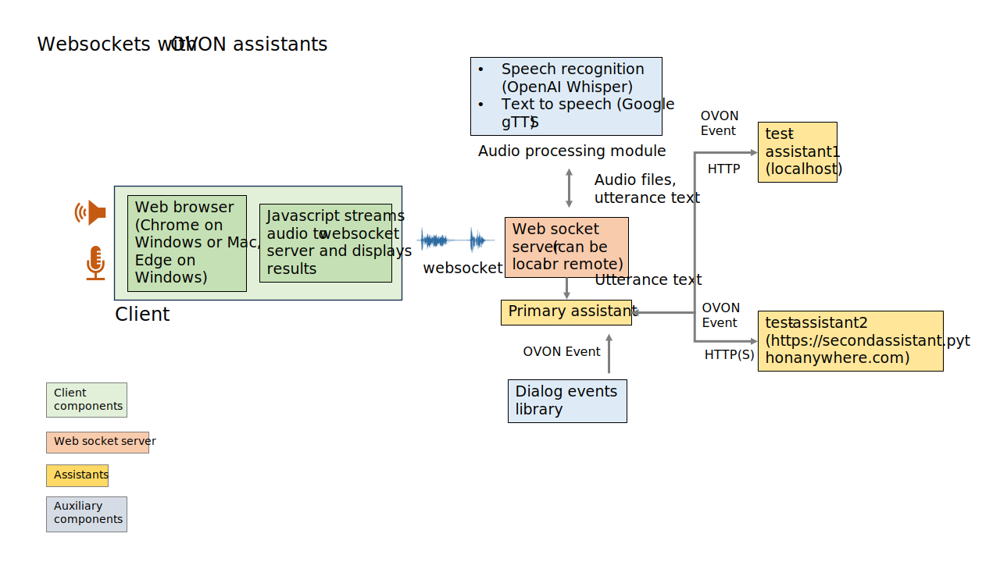

# Demonstration of using websockets to do server-side speech recognition and TTS
Websockets is a protocol that allows web servers to send messages directly to a client.
In this demonstration, the client is a web browser, the primary assistant is hosted on a websocket server, and the secondary assistants are hosted on HTTP(S) servers.
ASR and TTS are performed on the websocket server, so there is no need for the browser to have any speech capabilities. Right now the browser must be able to record PCM-formatted audio (Chrome on Windows and Mac, Edge on Windows but not Firefox on Windows or Safari on MacOS), but I believe this can be addressed by converting the audio to PCM on the server, although I haven't tried doing that.

ASR is done locally on the websocket server by the OpenAI Whisper speech recognizer, so it does not require cloud access. 
However, currently TTS is done in the cloud.

This setup could be used for the channeling pattern.
To run, open two terminal windows. Start the websocket server ("python websocketServer.py") in one window (assuming your "python" command starts Python 3).
Start the secondary server in the other terminal window ("python secondaryAssistantHTTP.py". Alternatively, you can run the server as a Flask application by running "secondaryAssistantFlask.py" in the other terminal window (you may need to install Flask).
There is also a cloud-based Flask server located at https://secondAssistant.pythonanywhere.com.
To run the application from a web browser, open "sendAudioToServer.html" in a Chrome browser on a Windows PC or Mac or an Edge browser on Windows.
This diagram shows how the components are organized.

These are the code components:

## Client-side code (HTML/Javascript):
### sendAudioToServer.html
1. Click on "start listening" to start streaming audio to the server
1. Give the application permission to use the microphone
1. Speak or type your request
1. Click "Stop listening" when finished speaking
1. The result will be displayed in the textarea in the browser
1. Plays the audio output from the server
This html page uses the following two scripts:

### captureAudio.js
1. sends the audio stream to the server
1. waits for the transcription from the server and updates the results

### updateResults.js
1. updates the conversationBox textarea with the transcription
1. updates the fromMessages and toMessages textarea with the dialog events
1. Note that the client does not use any OVON events itself.

## Server-side code (Python):
1. webSocketServer.py (primary assistant/websocket server)
1. Start the server at the command line with "python webSocketServer.py"
1. The server is set up to run on localhost, port 8765
1. The server waits for audio to be sent over a websocket from the web page
1. When the server receives audio, it saves an audio file and uses the "audio_processing" object to transcribe the file
1. It also sends the assistant responses to "audio_processing" to generate TTS
1. After procssing on the server, the transcription, TTS wav file and associated dialog event are returned to the client, where they are displayed in a browser window or played, depending on whether they're text or audio. 
1. Note that the only reason the dialog event is sent to the browser is so a developer can inspect it. The browser doesn't use it.
1. Similarly, the secondary assistant's response (transcription and dialog event) is displayed on the web browser.
1. Works on Chrome and Edge on Windows and Chrome on Mac

## audioProcessing.py
1. contains asr and tts functions
1. Asr is done with the open source OpenAI Whisper ASR software, which must be installed on the server, but which doesn't require internet access at runtime.
1. More information about Whisper and instructions for installing can be found at https://github.com/openai/whisper. Note that Whisper can be configured to use many models and supports many languages besides the one used in this example. As the Whisper installation instructions state, the "ffmpeg" utility must also be installed on this server for Whisper to work.
1. TTS is currently performed by the "audio_processing" object using the gTTS library, which does require internet access

## assistant.py
1. called by the web socket server with a transcription
1. performs primary assistant functions
1. generates dialog events
1. calls a secondary assistant by sending an HTTP POST message to its server

## secondaryAssistantHTTP.py
1. an HTTP server that accepts HTTP POST messages with OVON payloads from a primary assistant and sends them to a secondary assistant

## secondaryAssistantFlask.py
1. an alternative secondaryAssistant server that uses the Flask framework

## secondaryAssistant.py
1. processes OVON messages from a primary assistant and returns a response
1. contains the assistant functions; called from a server
1. this assistant can answer questions about auto maintenance, based on three intents, "oil change", "tire rotation" and "state inspection"
1. example utterances:

    a. do I need to change the oil in my car?
    b. do I need to rotate my tires?
    c. is it time for my car's state inspection?
    d. paraphrases of these utterances should also work

## nlp.py
1. this component is called by "assistant.py" to do nlp with one of the "gpt4all" large language models. These are open source models that can be run locally on Windows, Mac and Linux computers, without requiring a GPU. Different models can be swapped in for experimentation after installing "gpt4all". 
1. it is also possible to modify various parameters to affect the LLM performance

## nlpDB.py
1. a simple keyword based nlp, used by the secondary assistant
1. knows about a few simple kinds of auto maintenance 

## vehicle.py

## vehicle.json

## todo:
1. write a rudimentary discovery placeholder
1. add ASR confidence to OVON messages
1. add alternatives to OVON messages
1. change languages (use Whisper multilingual model)
1. use local TTS
1. multi-turn conversation
1. implement delegation pattern
1. more capable assistants

